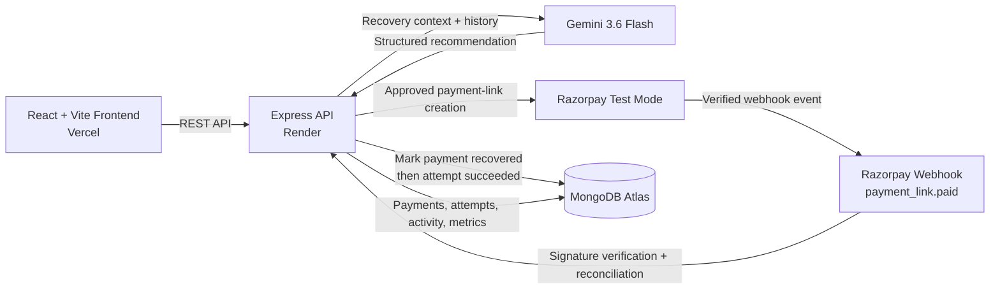

# RecoverAI

> **AI-powered payment recovery workflow for the Razorpay Buildathon**
>
> RecoverAI turns a failed payment into a controlled recovery workflow: it analyzes the payment context, records a structured recommendation, applies deterministic policy guardrails, dispatches a payment link only when approved, and reconciles recovery from a verified Razorpay webhook.

**Stack**

     

### [🚀 Live Demo](https://recover-ai-brown.vercel.app) · [🩺 Backend Health](https://recoverai-backend-2efq.onrender.com/api/health)

---

## Contents

- [Problem and solution](#problem-and-solution)
- [How the workflow works](#how-the-workflow-works)
- [AI and safety architecture](#ai-and-safety-architecture)
- [Product walkthrough](#product-walkthrough)
- [Two operating modes](#two-operating-modes)
- [Architecture](#architecture)
- [Environment variables](#environment-variables)
- [Deployment overview](#deployment-overview)
- [Testing and verification](#testing-and-verification)
- [Security and demo limitations](#security-and-demo-limitations)
- [Buildathon takeaway](#buildathon-takeaway)

---

## Problem and solution

A failed payment is not just a declined transaction. It can become **revenue leakage plus manual follow-up work**: someone has to decide whether the payment is worth retrying, determine whether a recovery message is appropriate, avoid over-attempting the same order, and verify what happened afterward.

RecoverAI packages that work into one workflow:

1. **Analyze the failure.** The recovery agent builds a non-PII payment context and recovery history, then asks Gemini for a structured recommendation.
2. **Apply policy.** A deterministic backend policy engine evaluates payment status, order attempt limits, available customer contact channels, human-review flags, and the configured amount threshold.
3. **Dispatch deliberately.** An approved recovery attempt can create a Razorpay payment link. The UI keeps analysis and dispatch as separate actions.
4. **Reconcile from evidence.** A verified `payment_link.paid` webhook links the payment link back to the recovery attempt and updates the original payment to `recovered` before the attempt is marked `succeeded`.

**AI recommends. The backend policy decides.** A model recommendation is never, by itself, permission to dispatch a payment link.

---

## How the workflow works

| Stage | What happens | Primary responsibility |
|---|---|---|
| **1. Payment Failed** | A failed Razorpay payment is available to RecoverAI for analysis. | Razorpay + backend |
| **2. Agent Analyzed** | Payment context and prior recovery history are assembled without sending raw customer contact details to the LLM path. Gemini returns a structured recommendation. | Gemini 3.6 Flash + recovery agent |
| **3. Policy Evaluated** | The recommendation is evaluated against deterministic guardrails. The outcome is `ALLOW`, `DENY`, or `HUMAN_REVIEW`. | Backend policy engine |
| **4. Link Dispatched** | Only an approved attempt can be dispatched. The executor re-reads current payment state before calling Razorpay and records the external payment-link reference. | Backend + Razorpay Test Mode |
| **5. Customer Paid** | In the buildathon demo, payment completion can be simulated through the demo console; in Razorpay Test Mode, the payment-link flow can produce a real Test Mode webhook. | Razorpay Test Mode / demo controls |
| **6. Payment Recovered** | The backend verifies the webhook signature, resolves the linked recovery attempt, changes the original payment from `failed` to `recovered`, then marks the attempt `succeeded`. | Verified webhook handler + MongoDB |

### Who does what?

- **Gemini 3.6 Flash**: analyzes payment context and recovery history and recommends an action.
- **Policy engine**: remains authoritative over whether the recommendation may proceed.
- **Backend**: orchestrates the workflow, persists audit records, re-checks live state at dispatch time, and keeps response payloads sanitized.
- **Razorpay**: creates payment links in Test Mode and emits the payment-link webhook used for reconciliation.
- **Webhook handler**: verifies the `X-Razorpay-Signature` HMAC before parsing or changing payment state.

---

## AI and safety architecture

RecoverAI is intentionally designed so that model output is advisory, structured, and constrained.

### Structured AI path

The recovery agent sends Gemini a payment context containing payment metadata, failure information, customer-presence flags, and aggregated history. The LLM is asked for JSON with a bounded action vocabulary, a confidence value, a reason, and a human-review flag. The backend validates the returned shape and values before using the recommendation.

### Deterministic policy is authoritative

The policy engine does not use the model's confidence score as a money-moving signal. It applies rules in a fixed order, including:

- stop when the payment is already `captured` or `recovered`;
- stop when the order has exhausted `RECOVERY_MAX_ATTEMPTS`;
- deny a payment-link action when neither email nor contact is available;
- escalate when the recommendation requires human review;
- escalate when the amount exceeds `RECOVERY_MAX_AMOUNT_PAISE`;
- deny invalid actions.

### Dispatch is a separate, guarded step

The frontend calls the analysis endpoint with `execute: false`. A second approval action dispatches the already-recorded attempt. Before calling Razorpay, the executor checks that the attempt is not already executed, the payment still exists, the payment is still `failed`, and a customer contact channel exists.

### Fail closed

If the real Gemini path is missing configuration, times out, returns a non-success response, produces unusable JSON, or fails validation, RecoverAI falls back to `HUMAN_REVIEW` rather than automatically choosing a recovery action.

### Webhooks are evidence, not decoration

The Razorpay webhook route keeps the raw request body, verifies the signature first, and only then parses the JSON payload. For `payment_link.paid`, the backend checks the payment-link reference against the stored recovery attempt and performs the state transition through the existing reconciliation path.

### Demo reset is fenced in

The reset endpoint is available only in `DEMO_MODE=true`, and the server accepts resets only for registered synthetic/demo payments. It deletes recovery attempts belonging to that demo payment only; arbitrary non-demo payment records are rejected.

---

## Product walkthrough

RecoverAI's dashboard is built around the recovery operator's view of the workflow.

### What you can see

| Dashboard area | Purpose |
|---|---|
| **KPI cards** | Revenue at risk, revenue recovered, recovery rate, payment counts, and recovery-attempt counts. |
| **Recovery Queue** | Failed payments waiting for recovery analysis and action. |
| **Payment Inspector** | Payment details, failure reason, recovery attempts, policy decisions, agent reasoning, and execution outcomes. |
| **Agent Activity** | Recent recovery-attempt audit activity. |
| **Interactive Recovery Lifecycle** | A six-stage walkthrough from failed payment to recovered state. |
| **Reset Demo** | Restores the synthetic demo payment so the walkthrough can be repeated. |

### A simple demo flow

1. Open the [Live Demo](https://recover-ai-brown.vercel.app).
2. On the dashboard, use the **Interactive Recovery Lifecycle** and start the walkthrough.
3. Watch the workflow move from **Payment Failed** through analysis and policy evaluation.
4. When the attempt is approved, RecoverAI creates the payment link in the active operating mode.
5. Complete the customer-payment step using the mode currently configured for the deployment.
6. Verify the final **Recovered** state and refreshed dashboard metrics.
7. Use **Reset Demo** to return the synthetic demo payment to `failed` for another run.

The demo is designed to make the important control boundary visible: **recommendation first, policy second, dispatch third, verified reconciliation last.**

---

## Two operating modes

RecoverAI has two distinct ways to demonstrate the workflow.

### Demo / mock mode

Use:

```env
DEMO_MODE=true
RAZORPAY_MOCK=true
LLM_MOCK=true
```

In this mode:

- the interactive demo uses synthetic records;
- Razorpay payment-link creation is mocked and does not call the external Razorpay API;
- Gemini recommendations are simulated and do not call the live LLM provider;
- the backend still exercises the real application state transitions and demo reconciliation logic.

**Mock recommendations are not real AI calls.** This mode is intended for a fast, repeatable buildathon walkthrough.

### Razorpay Test Mode + Gemini

For an integration-oriented run:

- `RAZORPAY_MOCK=false` allows the backend to use Razorpay credentials configured for **Test Mode**;
- `LLM_MOCK=false` routes the recommendation through Gemini using `LLM_API_KEY` and `LLM_MODEL`;
- approved recovery attempts can create a Razorpay Test Mode payment link;
- Razorpay sends the `payment_link.paid` event to the webhook endpoint;
- the backend verifies the webhook signature and performs the recovery reconciliation.

This is **not a production payment flow**. Razorpay remains in Test Mode for the buildathon demo.

---

## Architecture



The critical state transition is **webhook → backend verification/reconciliation → recovered**. A payment is not marked recovered merely because a link was created or because AI recommended recovery.

---

## Environment variables

### Backend

| Variable | Purpose |
|---|---|
| `MONGODB_URI` | MongoDB connection string. Use an isolated demo database for demo runs. |
| `PORT` | HTTP port for the Express server. |
| `FRONTEND_ORIGIN` | Allowed frontend origin(s) for CORS; comma-separated values are supported. |
| `RAZORPAY_KEY_ID` | Razorpay API key ID for the backend. Use a Test Mode key for the buildathon. |
| `RAZORPAY_KEY_SECRET` | Razorpay API secret. Keep it server-side only. |
| `RAZORPAY_WEBHOOK_SECRET` | Shared secret used to verify Razorpay webhook signatures. |
| `LLM_PROVIDER` | LLM provider configuration value used by the deployment. |
| `LLM_API_KEY` | API key for the configured LLM provider. |
| `LLM_MODEL` | Model identifier used by the Gemini request path; current example: `gemini-3.6-flash`. |
| `DEMO_MODE` | Enables the guarded `/api/demo/*` workflow. |
| `RAZORPAY_MOCK` | When `true` together with `DEMO_MODE=true`, generates synthetic payment links without outbound Razorpay calls. |
| `LLM_MOCK` | When `true`, returns the deterministic mock recommendation instead of calling Gemini. |
| `RECOVERY_MAX_ATTEMPTS` | Maximum recovery attempts permitted per Razorpay order by policy. |
| `RECOVERY_MAX_AMOUNT_PAISE` | Maximum amount eligible for automated recovery before policy escalates to human review. |

### Frontend

| Variable | Purpose |
|---|---|
| `VITE_API_BASE_URL` | Base URL used by the frontend for backend API requests. Leave blank locally to use the Vite `/api` proxy; set it to the Render backend URL for a decoupled deployment. |

### Safe placeholder example

```env
# backend/.env
MONGODB_URI=mongodb+srv://<user>:<password>@<cluster>/<database>
PORT=5000
FRONTEND_ORIGIN=https://recover-ai-brown.vercel.app

RAZORPAY_KEY_ID=rzp_test_<your_test_key_id>
RAZORPAY_KEY_SECRET=<your_test_key_secret>
RAZORPAY_WEBHOOK_SECRET=<your_webhook_secret>

LLM_PROVIDER=gemini
LLM_API_KEY=<your_gemini_api_key>
LLM_MODEL=gemini-3.6-flash

DEMO_MODE=false
RAZORPAY_MOCK=false
LLM_MOCK=false

RECOVERY_MAX_ATTEMPTS=<positive_integer>
RECOVERY_MAX_AMOUNT_PAISE=<positive_integer>
```

```env
# frontend/.env
VITE_API_BASE_URL=https://recoverai-backend-2efq.onrender.com
```

---

## Deployment overview

RecoverAI is deployed as a decoupled frontend/backend application:

| Component | Deployment | Configuration |
|---|---|---|
| **Frontend** | Vercel | `VITE_API_BASE_URL=https://recoverai-backend-2efq.onrender.com` |
| **Backend** | Render | `FRONTEND_ORIGIN=https://recover-ai-brown.vercel.app` plus backend environment variables |
| **Database** | MongoDB Atlas | Application persistence and recovery-attempt audit data |
| **Payment integration** | Razorpay Test Mode | Test credentials and verified webhook |
| **AI integration** | Gemini 3.6 Flash | Called by the backend when `LLM_MOCK=false` |

### Razorpay webhook

Configure the Razorpay Test Mode webhook to point to:

```text
https://recoverai-backend-2efq.onrender.com/api/webhooks/razorpay
```

The backend keeps the webhook request body raw long enough to verify `X-Razorpay-Signature`, then processes supported events. The payment-link recovery path uses `payment_link.paid` to reconcile the recovery attempt.

**Keep Razorpay in Test Mode for the buildathon demo.**

---

## Testing and verification

The repository contains focused Node-based verification scripts in `backend/scripts/` plus frontend lint/build commands. Run the suites from the `backend/` or `frontend/` directories as shown.

### Demo safety

```bash
cd backend
node scripts/testSafeDemoReset.js
node scripts/testExecutorStatusGuard.js
```

These scripts cover the guarded demo reset behavior and dispatch-time status protections.

### Demo workflow

```bash
cd backend
node scripts/testDemoWorkflow.js
```

This covers the demo-mode workflow, synthetic payment-link creation, simulated payment reconciliation, idempotency, and sanitized responses.

### Dashboard and API routes

```bash
cd backend
node scripts/testDashboardStats.js
node scripts/testPaymentsRoute.js
node scripts/testPaymentDetailRoute.js
```

These scripts exercise dashboard aggregation, payment filters/limits, payment-detail responses, ordering, and response allowlists.

### Recovery reconciliation

```bash
cd backend
node scripts/testRecoveryLinkage.js
```

This verifies order-level linkage behavior when a captured payment is reconciled with a prior failed payment.

### Frontend lint and build

```bash
cd frontend
npm run lint
npm run build
```

> These are the repository's documented verification commands. This README does **not** claim that they have passed in the current environment unless separately verified.

### Optional Razorpay link check

The repository also includes a safe dry-run script:

```bash
cd backend
node scripts/testCreatePaymentLink.js
```

That dry run makes no Razorpay API request. The script also supports a live `--apply` path when explicitly invoked with suitable Test Mode configuration and `TEST_CONTACT`.

---

## Security and demo limitations

- Never commit `.env` files or API keys.
- Use an isolated demo database for buildathon runs.
- Keep Razorpay in Test Mode.
- Restrict MongoDB network access when possible.
- Demo reset only targets registered synthetic/demo payment records.
- This is a **buildathon demonstration**, not a production-ready payment operations platform.

---

## Buildathon takeaway

**AI recommends. Policy controls. Razorpay processes. Webhooks verify.**

RecoverAI's core idea is simple: use AI where judgment helps, keep money-moving decisions behind deterministic controls, and treat verified provider events as the source of truth for recovery.